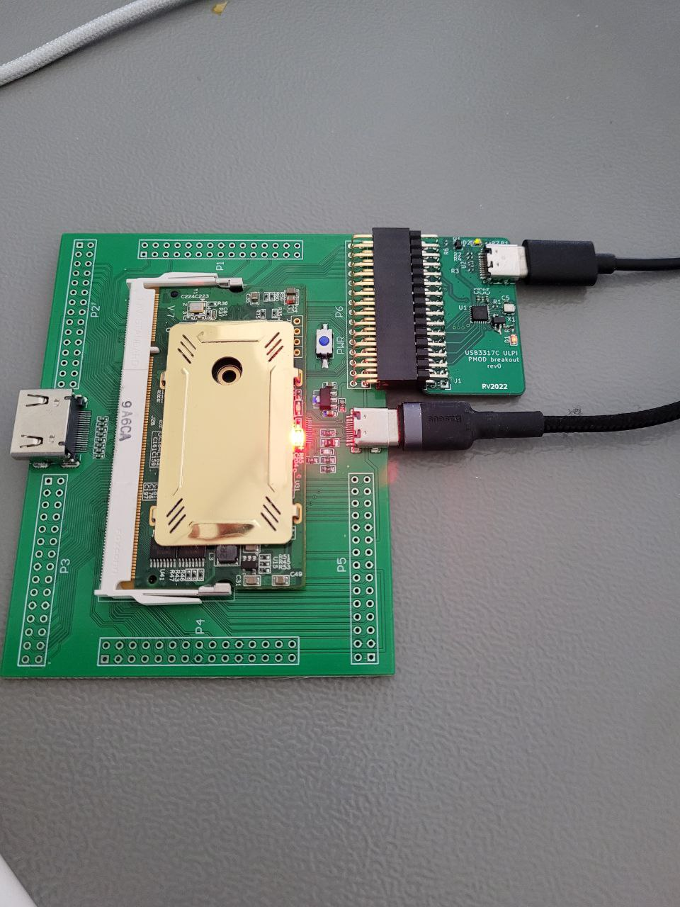

USB ULPI phy for Colorlight i5 SOM development board
------------------------------------------------------

Hardware design for dual-PMOD style USB ULPI phy breakout board. 

By default, the design assumes that 24MHz oscillator provides clock to phy, and 60MHz clock generated by PHY is routed to FPGA.
It is possible to supply 24MHz clock from FPGA- see schematic for details.

The design is most likely compatible with several SMSC/Microchip USB phy's from the same series, using different oscillator frequencies (for instance, this board
was first designed for USB3317C, but it went out of stock while the board was designed).

Change history
--------------------

__Revision 0__:

   * VDD1.8 was not connected, as I assumed USB3315C has internal 1.8V regulator. It does not.
   * After bodging a regulator, the design enumerates using LUNA gateware

__Revision 1__:

   * Added 1.8V LDO which was required for the used phy

